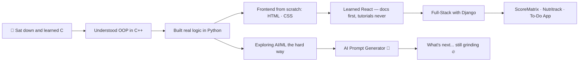

<div align="center">


<br/>

[](https://www.linkedin.com/in/t-deepak-kumar-patro-230753367/)
[](mailto:talasudeepak06@gmail.com)
[](https://portfolio-neon-theta-82.vercel.app/)
[](https://github.com/Talasudeepk)

</div>

---

## 🔥 About Me

> *"I vibe with the idea. Then I sit down and hard-code every bit of it — because I need to know WHY it works, not just THAT it works."*

I'm a 2nd-year B.Tech CSE student at KL University (CGPA: 9.23/10). I'm somewhere between a vibe coder and a grinder — I get inspired fast, but I don't move until I understand the foundation. No copy-paste shortcuts. No magic wrappers I can't explain. Just clean, deliberate code written line by line.

- 🧱 I **hard-code first** — frameworks come after I understand what they're abstracting
- 🌙 The kind of person who stays up figuring out *why* the bug exists, not just fixing it
- 🔨 Currently grinding on **AI Prompt Generator** — because I wanted to understand how AI really works
- 💡 Vibe hits → I plan → I grind → I ship. That's the loop.
- 🏆 National Level **Smart India Hackathon** · **Hack2Skill** Hackathon
- ⚡ Fun fact: I built a To-Do app in React and still read the docs instead of copying Stack Overflow

---

## ⚒️ My Coding Philosophy

```text
┌─────────────────────────────────────────────────────┐
│                                                     │
│   Step 1: Get the vibe. Understand the problem.     │
│   Step 2: Plan it on paper (yes, actual paper).     │
│   Step 3: Write every line. Read every doc.         │
│   Step 4: Debug until I understand the root cause.  │
│   Step 5: Ship it. Then make it better.             │
│                                                     │
│   Shortcuts are borrowed time. Hard work is owned.  │
│                                                     │
└─────────────────────────────────────────────────────┘
```

---

## 🛠️ Tech Stack

<div align="center">

### 💻 Languages — things I actually understand, not just use


### 🌐 Frontend — built pixel by pixel


### ⚙️ Backend & Tools


### 🤖 Currently Exploring — with full understanding, not just hype


</div>

---

## 🚀 Projects — Built From Scratch. No Magic.

<div align="center">
<table>
<tr>
<td width="50%">

### 📊 ScoreMatrix
**Student Analytics Platform**

```text
Stack: Django · Bootstrap · HTML
       Custom logic. Zero shortcuts.
Status: ✅ Completed
```

Full-stack student analytics platform — backend, data layer, and UI all written by hand. Didn't reach for a ready-made admin panel. Built the logic myself so I could own every part of it.

[](https://github.com/Talasudeepk)

</td>
<td width="50%">

### ✅ To-Do List App
**React — Component by Component**

```text
Stack: React.js
       Read the docs. Not Stack Overflow.
Status: ✅ Completed
```

Didn't copy a tutorial. Read the React docs, understood state and event handling from scratch, then built it. Simple app, solid foundation.

[](https://github.com/Talasudeepk)

</td>
</tr>
<tr>
<td width="50%">

### 🥗 Nutritrack
**Recipe Validator — Pure Logic**

```text
Stack: Python · FSSAI Data · Logic
       No ML library. Just structured thinking.
Status: ✅ Completed
```

Validates recipes against FSSAI nutritional guidelines and suggests healthier swaps. Built with raw Python logic — no fancy ML models, just data, conditions, and clear thinking.

[](https://github.com/Talasudeepk)

</td>
<td width="50%">

### 🤖 AI Prompt Generator
**Because I Wanted to Understand AI, Not Just Use It**

```text
Stack: Python · Prompt Engineering
       Still figuring it out. That's the point.
Status: 🔨 Ongoing
```

Building a tool to craft optimized prompts for AI models. Not using someone else's prompt library — understanding the principles myself and coding it bottom-up.

[](https://github.com/Talasudeepk)

</td>
</tr>
</table>
</div>

---

## 💼 Who I Am in Code

```javascript
const deepak = {
    role: "CS Student · Web Dev · Hard Coder with Vibe",
    university: "KL University, Vijayawada",
    cgpa: 9.23,

    coderType: "vibe coder who believes in understanding every single line",
    rule: "if I can't explain it, I don't use it",

    languages: ["Python", "C++", "C", "JavaScript", "Java"],
    stack: {
        frontend: ["React", "HTML5", "CSS3", "Bootstrap"],
        backend: ["Django"],
        tools: ["Git", "GitHub Copilot*", "VS Code", "Arduino"],
        note: "*Copilot is a suggestion, not a crutch"
    },

    workStyle: {
        approach: "understand first, code second",
        debugging: "finds root cause, doesn't just patch symptoms",
        attitude: "stays until it's done and done RIGHT"
    },

    currentlyGrinding: "AI Prompt Generator — understanding AI from the ground up",
    motto: "Vibe with the idea. Hard-code the execution."
};
```

---

## 📊 GitHub Analytics

<div align="center">
  
  &nbsp;
  
</div>

<div align="center">
  
</div>

<div align="center">
  
</div>

---

## 🏆 Achievements

<div align="center">

| 🏅 | Achievement | What it took |
|:---:|:---|:---|
| 🇮🇳 | Smart India Hackathon | National Level — built under pressure, shipped anyway |
| 🚀 | Hack2Skill Hackathon | Rapid prototyping — fast hands, clear head |
| 📚 | NPTEL Machine Learning | Sat through theory because I needed to understand, not just apply |
| 🤖 | GitHub Copilot Certified | Know how to use it. Know when NOT to trust it. |
| 🗣️ | Cambridge Linguaskill | English — CEFR B1 |

</div>

---

## 📈 The Grind Map



---

## 🤝 Let's Connect

<div align="center">

If you respect the grind and want to build something real — let's talk.

[](https://www.linkedin.com/in/t-deepak-kumar-patro-230753367/)
[](mailto:talasudeepak06@gmail.com)
[](https://github.com/Talasudeepk)
[](https://portfolio-neon-theta-82.vercel.app/)

### 💬 *"I vibe with the idea. I learn and hard-code the execution. Let's build something that lasts. 🔥"*

</div>  


<div align="center">


**🔥 vibe with it. grind through it. ship it. 🔥**

*Every line written by hand. Every concept understood before used.*

</div>
